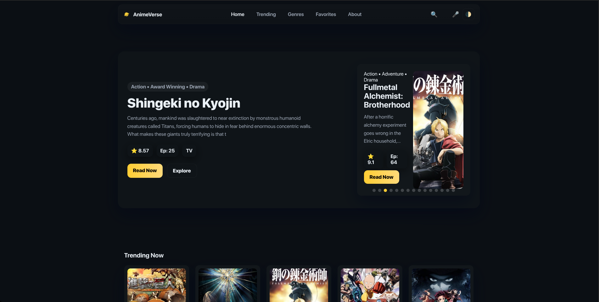
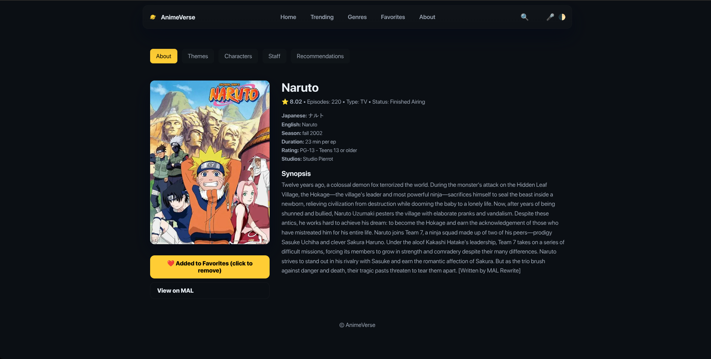
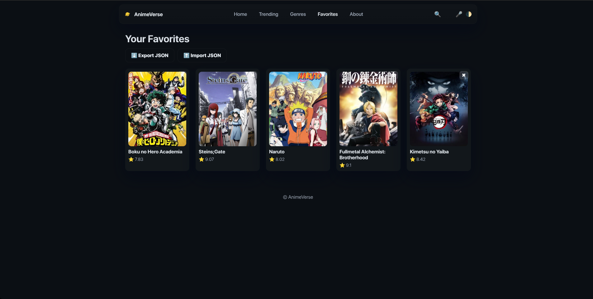
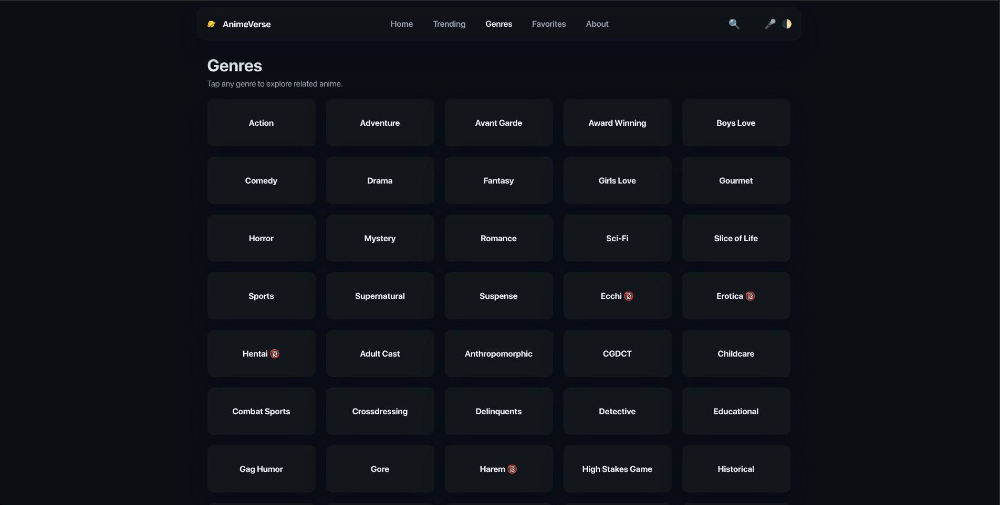
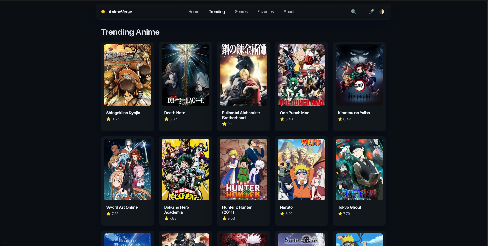

<p align="center">
  
</p>

A modern, multi-page anime discovery experience powered by the **Jikan API**.
Browse trending anime, explore genres, search with live suggestions, manage favorites, and enjoy a cinematic UI inspired by premium manga/anime websites.

🌐 **Live Demo:**
👉 [https://bishwajit-2810.github.io/AnimeVerse/](https://bishwajit-2810.github.io/AnimeVerse/)

---

# 📸 Screenshots

### **Home Page**



### **Anime Details Page**



### **Favorites Page**



### **Genres + Adult Content Popup**



### **Tranding Page**



---

# ⭐ Features

### 🎨 **Modern UI**

- Glassy header
- Cinematic hero banner
- Auto-sliding carousel
- Smooth light/dark mode
- Fully responsive (desktop → mobile)

### 🔎 **Smart Search**

- Live suggestions
- Debounced API requests
- Voice search support
- Redirect to search results page
- Saves recent search terms

### 📄 **Anime Details**

- Poster, score, episodes, rating info
- Synopsis
- Characters
- Staff
- Recommendations
- Theme songs (OP/ED)
- Trailer embed
- Add/remove from favorites

### 🧡 **Favorites System**

- Stored locally using `localStorage`
- Import/export favorites as JSON
- Remove items individually
- Persistent across visits

### 🏷 **Genres + Adult Gating**

- Genre grid generated dynamically
- Restricted categories trigger a confirmation popup
- “Remember my choice” option

### ⚡ **Performance**

- Safe API wrapper with retry handling (429 protection)
- Cached genre results
- Lazy loading images
- Optimized DOM rendering

---

# 🛠 Tech Stack

| Layer      | Technology                          |
| ---------- | ----------------------------------- |
| Frontend   | **HTML, CSS, JavaScript (Vanilla)** |
| API        | **Jikan REST API v4**               |
| Storage    | **localStorage**                    |
| Deployment | **GitHub Pages**                    |
| Assets     | Custom PNG logo                     |

---

# 📁 Folder Structure

```
AnimeVerse/
│
├── index.html
├── trending.html
├── genres.html
├── favorites.html
├── anime.html
├── about.html
├── search.html
│
├── assets/
│   ├── css/
│   │   ├── reset.css
│   │   └── style.css
│   │
│   ├── js/
│   │   ├── api.js
│   │   ├── app.js
│   │   └── theme.js
│   │
│   ├── images/
│   │   ├── favicon.png        ← **your logo**
│   │   └── placeholder.jpg
│   │
│   └── icons/
│
├── screenshots/
│   ├── home.png
│   ├── details.png
│   ├── favorites.png
│   ├── genres.png
│   └── search.png
│
└── README.md
```

---

# ⚙️ Installation (Local)

### 1️⃣ Clone the repo

```
git clone https://github.com/your-username/AnimeVerse.git
cd AnimeVerse
```

### 2️⃣ Open any HTML file

No build tools, no dependencies. Just open in browser.

---

# 🌐 Deployment

AnimeVerse is deployed using **GitHub Pages**:
📍 [https://bishwajit-2810.github.io/AnimeVerse/](https://bishwajit-2810.github.io/AnimeVerse/)

To redeploy:

1. Push new changes to `main`
2. GitHub Pages updates automatically

---

# 📡 API Reference (Jikan v4)

AnimeVerse uses:

| Purpose         | Endpoint                         |
| --------------- | -------------------------------- |
| Trending        | `/top/anime?filter=bypopularity` |
| Top Rated       | `/top/anime?filter=airing`       |
| Search          | `/anime?q=query&limit=10`        |
| Genres          | `/genres/anime`                  |
| Details         | `/anime/{id}`                    |
| Characters      | `/anime/{id}/characters`         |
| Staff           | `/anime/{id}/staff`              |
| Recommendations | `/anime/{id}/recommendations`    |
| Themes          | `/anime/{id}/themes`             |

Includes a **safeFetch** method with retry support.

---

# 🤝 Contributing

Contributions are welcome!

1. Fork the project
2. Create a new branch
3. Commit improvements
4. Submit a pull request

---

# 📝 License

MIT License
Free to use, modify, and share.

---

# ❤️ Credits

- Anime data via **Jikan API**
- Design & development by **Bishwajit Chakraborty**
- Created as a modern, multi-page anime browsing platform

---
